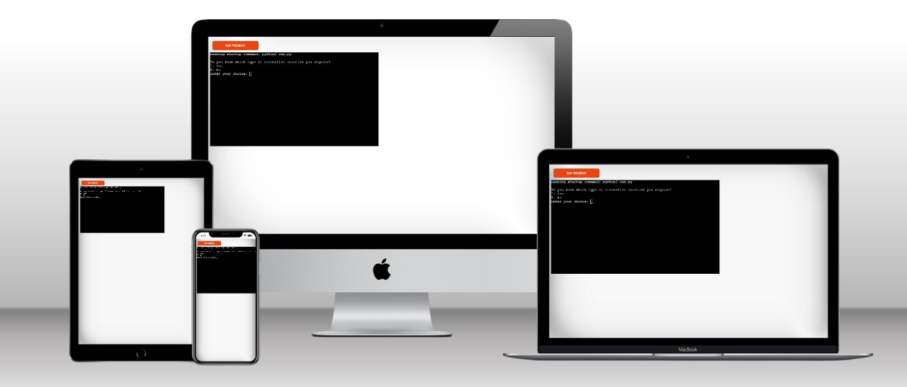
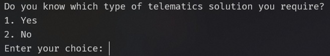

# Vision Telematics - Telematics solution wizard
The purpose of this Python console application, is to allow potential customers who have an interest in telematics, to answer a few simple questions in order to determine the best telematics hardware product/solution to meet their needs. This directly relates to the Project 1 & 2 website (RS Vision Consulting website) and I plan to build upon Project 3 further, in projects 4 and 5 where we intend to build a complete "Telematics solution wizard" with front and backend services. Please see the below section on future mplementations for further details. I wanted to build a real-world useful business application for Project 3. Please see the following link to the Python Console application.

[Live version of the program](https://project03-66119f33b52f.herokuapp.com/)

<div align="center">
    
</div>

#### How to run
- The user will simply read the questions and provide answers to these questions
- The user will input the answer to the questions by entering the number which corresponds to the relevant question

#### Script Functions
#### 1. `select_asset()`
- **Purpose:** Guides the user through selecting a vehicle or asset type, answering relevant questions/the reason for needing a telematics solution.
- **Input:** The user selects vehicle/asset type and the answer to the relevant questions in order to determine the best solution to meet the customers needs.
- **Output:** Provides a recommendation/s based on the user's inputs as to the best product to meet their needs.

#### 2. `asset_tracking()`
- **Purpose:** Assists the user in selecting a tracking solution for various asset types including agricultural equipment, bins, pallets, plant machinery etc.
- **Input:** The user selects asset type and whether the asset is a powered or unpowered asset e.g. whether the asset has it's own power source to power the tracking hardware or whether the device should run independently from its own battery. 
- **Output:** Provides specific telematics solution recommendations based on the asset type, use case and operational environment.

#### 3. `vehicle_tracking()`
- **Purpose:** Helps users select tracking solutions for different vehicle types.
- **Input:** User selects vehicle type and required features.
- **Output:** Offers recommendation/s for tracking devices based on the users selected features.

#### 4. `stolen_vehicle_or_asset_tracking()`
- **Purpose:** Provides solutions for tracking stolen vehicles or assets.
- **Input:** User selects the type of asset and any required features.
- **Output:** Recommends the appropriate tracking solutions for stolen assets based upon the customers input requirements.

#### 5. `video_telematics()`
- **Purpose:** Guides users in selecting video telematics solutions, such as dashcams and DVR systems.
- **Input:** User selects the type of video telematics and whether an in-vehicle monitor is required.
- **Output:** Provides specific video telematics product recommendations based on user inputs.

#### 6. `select_type()`
- **Purpose:** Allows users to choose the type of telematics service they require.
- **Input:** User selects the service type (Asset Tracking, Vehicle Tracking, Stolen Vehicle & Asset Tracking, Video Telematics).
- **Output:** Calls the appropriate function based on the users selection.

### Main Execution Loop

The main execution loop is the entry point of the script. It repeatedly prompts the user to determine whether they know the type of telematics solution they require. Based on the user's input, it directs them to the appropriate function to gather more information or make a recommendation.
<div>
    
</div>

### Code Explanation
```python
if __name__ == "__main__":
    running = True
    while running:
        print("Do you know which type of telematics solution you require?")
        print("1. Yes\n2. No")
        a = input("Enter your choice: ")
        if a == "1":
            select_type()
            running = False
        elif a == "2":
            select_asset()
            running = False
        else:
            print("Invalid input. Try again.")
```

#### Detailed Steps
1. **Check if Script is Running as Main Program:**
    - if `__name__ == "__main__":` ensures that the code block is executed only if the script is run directly, not if it is imported as a module in another script.
2. **Initialize Running State:**
    - `running = True` sets up a flag to keep the loop running until the user makes a valid choice.
3. **Main Loop:**
    - `while running:` starts an indefinite loop that will continue until running is set to False.
4. **User Prompt:**
    - The script prints: "Do you know which type of telematics solution you require?" and provides two options:
        - `1. Yes`
        - `2. No`
    - `a = input("Enter your choice: ")` captures the user's input.
5. **User Input Handling:**
    - If the user inputs `1`, the script calls `select_type()`, which allows the user to choose the specific type of service they need. After calling the function, `running` is set to `False`, exiting the loop.
    - If the user inputs `2`, the script calls `select_asset()`, which guides the user through selecting a vehicle or asset type and the reason for needing a tracking solution. After calling the function, `running` is set to `False`, exiting the loop.
    - If the user inputs anything else, the script prints "Invalid input. Try again." and the loop continues, prompting the user again.

#### User Interaction Flow
1. Initial Prompt: The script asks the user if they know the type of telematics solution they require.
    - Option 1: If the user selects "Yes," the script proceeds to `select_type()` where they choose the specific type of service.
    - Option 2: If the user selects "No," the script calls `select_asset()` to guide them through the selection process based on asset type and tracking reason.
2. Service Selection: Depending on the user's selection in `select_type()`, the script will call one of the following functions:
    - `asset_tracking()`
    - `vehicle_tracking()`
    - `stolen_vehicle_or_asset_tracking()`
    - `video_telematics()`
3. Recommendations: Each function provides tailored recommendations based on user inputs, ensuring they receive the most suitable telematics solution.

#### Data Usage
- Asset Types: The script categorizes various assets and vehicles, each associated with specific tracking solutions.

- Reasons for Tracking: Different reasons for tracking (e.g. Insurance, theft protection, regulatory requirements) influence the recommendation.
- Features: Specific features required by the user (e.g. Driver ID, Fuel Monitoring, Video integration) further refine the recommendations.
- Contact Information: Recommendations often include a prompt to contact a team member for further discussion and implementation of the solution as a call to action.

By following the structured input prompts, the user receives personalised and relevant telematics solution recommendations, ensuring the user is presented with the most relevant telematics solution in order to meet their needs.

#### Future Implementation
As mentioned in the introductory paragraph, I plan to build upon Project 3 further, in projects 4 and 5. I intend to build a complete "Telematics solution wizard" with front and backend services. This will effectively allow potential customer to register their interest, navigate through some interactive questions / options and be presented with relevant product information and comparisons to enable the customer to make a more informed decision". This will be designed to take customers through a typical fact-finding process which would normally be undertaken by a sales person, in an automated way. We will also look to build a quote and potentially allow the customer to order online, where currently this is not possible due to acquiring the answers to relevant questions in order to be able to determine the best solution to meet the customers needs.

#### Validator Testing
- PEP8 linting test from [CI Python Linter](https://pep8ci.herokuapp.com/)
- Manually tested each function
- No Errors Found

#### Bugs
There were a few bugs while developing the program. There were some missplet words which were fixed. Also there were some functional issues because I've used Python Dictionary to store and structure the data. After all these issues were addressed the program functioned well. 
There were/are no bugs are found within the deployed code.

#### Deployment
This poject was deployed using the Heroku Platform
- Fork or clone the template repository
- Create a new app on Heroku
- Setup the buildpacks for `python` and `NodeJS`
- Connect Github account to the app
- Selected the Repository 
- Clicked on Deploy

#### Credits
- Code institute template
- Online resources
- Telematics industry research in relation to the Question & Answer / Product logic from the business owner of RS Vision Consulting/Vision Telematics
